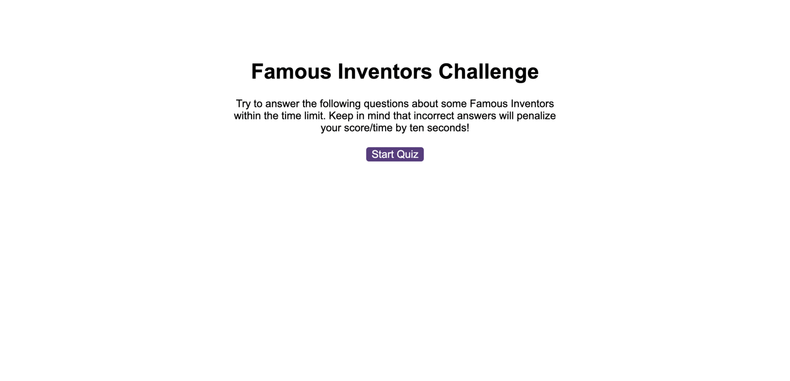

# Code Quiz Game About Hungarian Inventors

# Description

An interactive quiz about inventors. 
Overview of the project:
* 5 questions each of them with 4 options
* highscores at the end
* set timer that gets lowered as user chooses wrong answer
* has the ability to clear stored data by users

* to add later on: sound did not work with my code therefore I removed it as I ran out of time before submission and I had computer issues as well. 

## Table of Contents

<!-- vscode-markdown-toc -->
*  [Deployed Page](#DeployedPage)
*  [Installation](#Installation)
*  [Usage](#Usage)
*  [Credits](#Credits)
*  [License](#License)

<!-- vscode-markdown-toc-config
	numbering=true
	autoSave=true
	/vscode-markdown-toc-config -->
<!-- /vscode-markdown-toc -->

## Deployed Page

[Link to Deployed Github Page](https://github.com/beatak777/code-quiz)

## Installation

No Installation necessary. 

## Usage

No Usage necessary.

## Credits

- Study materials provided by [edX Bootcamp](https://www.edx.org/course/skills-bootcamp-in-front-end-web-development).

- Table of Contents was Created with the Visual Studio Code Extension 'Markdown TOC' available [here](https://marketplace.visualstudio.com/items?itemName=dumeng.markdown-toc).

- Page created by [Bea Konya](https://github.com/beatak777).

- Special thanks to my friend Shlomi S..

- Special thanks to [ChatGPT](https://chat.openai.com) that helped me deubg my code a few times.

- I also used [WebDevSimplified](https://www.youtube.com/watch?v=iiADhChRriM) tools for this project like this one about JSON.

## License

MIT License. Please refer to the LICENSE in the repo for further information.